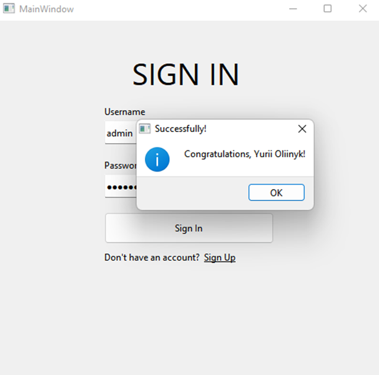

# LoginRegisterApp

Проект "LoginRegisterApp" - це програма з графічним інтерфейсом для реєстрації та авторизації користувачів у системі. Для забезпечення роботи програми необхідно встановити та налаштувати реляційну базу даних на локальному сервері.

## Встановлення

1. Завантажте вихідний код з репозиторію.
2. Відкрийте проект у середовищі Qt.
3. Збережіть проект.
4. Зберіть та запустіть програму у середовищі Qt.

## Використання

Після запуску програми ви побачите вікно з можливістю реєстрації та авторизації користувачів. Дотримуйтесь інструкцій на екрані для взаємодії з програмою.

## Приклади роботи програми

## Автор

**Олійник Юрій**

- Пошта: olijnikura@gmail.com
- Телеграм: [@rodtzdream](https://t.me/rodtzdream)

## Ліцензія

Цей проект є опенсорсним, що означає, що ви можете вільно використовувати, модифікувати та розповсюджувати його в межах умов ліцензії. 

Детальну інформацію можна знайти у файлі README.md або шляхом звернення до автора.
